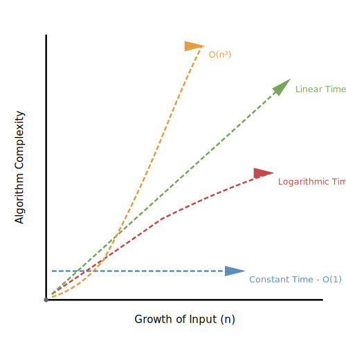

# Measuring Performance

Open the Health app on your iPhone. Scroll through years of step counts, heart rate readings, and workout data—thousands of entries. The app remains responsive, instantly finding your fastest 5K or calculating weekly averages. Now imagine the same app checking every single data point every time you asked a question. With 50,000+ health readings, a simple query would take minutes instead of milliseconds.

When we write code we're creating instructions for the computer to follow. But how does your code behave when the amount of data changes? Does it slow down gracefully, or does it grind to a halt? Understanding this relationship between data size and performance is essential to building software users will love—whether you're building the next fitness tracker, managing patient records, or analyzing athletic performance data.

## Why performance matters

Consider Netflix. They serve over 200 million users worldwide. When someone searches for science fiction, the system must quickly find relevant titles among hundreds of thousands of options. An inefficient search [algorithm](https://en.wikipedia.org/wiki/Algorithm) that works fine with 100 movies becomes unusable with 100,000. This isn't a hypothetical problem—it's the reality of modern software development.

In the fitness space, consider Strava. When you finish a marathon, the app analyzes your pace across 26.2 miles of GPS data, identifies your fastest splits, compares performance to previous runs, and generates insights—all while you're catching your breath. An inefficient algorithm would keep you waiting minutes for results. A well-designed algorithm delivers them in seconds.

The difference between a slow algorithm and a fast one isn't always obvious with small datasets. Testing with 10 workouts might work fine. But as your data grows—hundreds of runs, thousands of strength training sessions, millions of heart rate readings—the choice of algorithm determines whether your application feels instant or becomes frustratingly slow. This is why iOS developers use tools like Instruments and Time Profiler to measure real performance before problems reach users.

## The language of performance

To discuss algorithm efficiency, developers use a common vocabulary: [Big O Notation](https://en.wikipedia.org/wiki/Big_O_notation). Rather than saying this algorithm checks every element, we say this is `O(n)`. Rather than explaining this eliminates half the data with each step, we write `O(log n)`. This notation provides a shorthand for describing how algorithms scale.

Consider Big O notation as a way to classify algorithms into performance categories. Just as we might describe a car as fuel-efficient or gas-guzzler without specifying exact miles per gallon, Big O notation categorizes algorithms by their growth patterns without getting lost in implementation details.

The `O` stands for order of magnitude—it tells us the scale of how an algorithm's performance grows as input size increases. The expression in parentheses describes the relationship between input size (usually called n) and the number of operations.

## Constant time

Some operations take the same amount of time regardless of data size. Accessing a specific array index is `O(1)`—whether your array has 10 items or 10 million items, getting `array[5]` is instant. The computer knows exactly where to find that position in memory.

Think of it like using a bookmark in a book. Finding the bookmarked page takes the same amount of time whether the book has 100 pages or 1,000 pages—you just open to the bookmark. In a fitness app, looking up your profile settings works this way—whether you have 10 workouts logged or 10,000 workouts, accessing your preferred units (miles vs kilometers) is instant. [Hash table](https://en.wikipedia.org/wiki/Hash_table) lookups ([Chapter 15](15-hash-tables.md)) work this way: they jump directly to the answer without searching.

## Logarithmic time

[Binary search](https://en.wikipedia.org/wiki/Binary_search_algorithm) demonstrates logarithmic performance. Each comparison eliminates half the remaining possibilities. For 1,000 items, we need about 10 comparisons. For 1 million items, only about 20 comparisons. Doubling the data size only adds one more step.

This halving pattern appears throughout computer science. When a running app finds your personal record 5K time from a sorted list of thousands of runs, it uses binary search—checking the middle run, then eliminating half the remaining data, repeatedly narrowing down to your PR. Balanced [binary search trees](https://en.wikipedia.org/wiki/Binary_search_tree) ([Chapter 11](11-binary-search-trees.md)) maintain `O(log n)` operations by keeping data organized in a way that allows cutting the search space in half repeatedly.

## Linear time

When an algorithm must examine each element once, we call it linear time or `O(n)`. Searching an unsorted list works this way—in the worst case, we check every element. The time grows in direct proportion to the input size: twice the data means roughly twice the time.

If you wanted to find which workout had the highest average heart rate, and your workouts weren't organized by heart rate, you'd need to check every single workout. Double your workout count, double your search time. This is linear time in action.

Linear time operations are sometimes called brute force because they make no assumptions about the data organization. They're often the simplest solution but not always the fastest. [Chapter 3](03-basic-searching.md) explores searching, including when linear search is appropriate.

## Linearithmic time

This pattern combines linear and logarithmic behavior. [Quicksort](https://en.wikipedia.org/wiki/Quicksort) ([Chapter 5](05-advanced-sorting.md)) demonstrates `O(n log n)` performance. It divides data recursively (the log n part) and processes each piece (the n part). This is often the best we can achieve for comparison-based sorting.

## Quadratic time

Nested loops often produce quadratic time complexity. Bubble sort, insertion sort, and selection sort ([Chapter 4](04-basic-sorting.md)) all exhibit `O(n²)` behavior. The performance degrades dramatically: doubling the data size roughly quadruples the time. For 100 items, we might do 10,000 operations. For 1,000 items, about 1,000,000 operations.

Imagine comparing every workout to every other workout to find which pairs were run on the same day. For 100 workouts, that's 10,000 comparisons. For 1,000 workouts, it's 1,000,000 comparisons. Your app would freeze.

Quadratic algorithms work fine for small datasets but become impractical as data grows. Understanding why they're `O(n²)` helps you recognize when to choose a different approach.

## Exponential time

Some algorithms' performance explodes exponentially. The naive recursive Fibonacci calculation ([Chapter 16](16-dynamic-programming.md)) demonstrates this—calculating `fib(40)` requires over a billion operations. These algorithms are typically unusable for n larger than about 30-40:



## Visualizing the difference

Let's see how these complexities compare with actual numbers. This table reveals why algorithmic efficiency matters. An `O(n²)` algorithm that works fine with 100 elements becomes painfully slow with 10,000 elements. But an `O(log n)` algorithm barely notices the difference:

| Input Size | O(1) | O(log n) | O(n) | O(n log n) | O(n²) |
|------------|------|----------|------|------------|-------|
| 10         | 1      | 3          | 10     | 30           | 100     |
| 100        | 1      | 7          | 100    | 700          | 10,000  |
| 1,000      | 1      | 10         | 1,000  | 10,000       | 1,000,000|
| 10,000     | 1      | 13         | 10,000 | 130,000      | 100,000,000|


## Simplification rules

When determining Big O notation, we follow two essential rules that focus on how algorithms scale rather than their exact operation counts. Consider an algorithm that performs 3n operations. We express this as `O(n)`, not `O(3n)`. Why? Because Big O notation describes growth patterns, not precise timings. Whether your algorithm takes 3 steps per item or 300 steps per item, it still grows linearly with input size. The constant factor matters for real-world performance, but not for classifying the algorithm's scalability.

Similarly, an algorithm performing n + 5 operations is `O(n)`. The constant 5 becomes insignificant as n grows large. For n = 1,000,000, the difference between n and n + 5 is negligible.

### Keeping the dominant term

When an algorithm contains multiple components with different growth rates, we keep only the fastest-growing term. Consider an algorithm that performs `n² + 5n + 3` operations:

```swift
For n = 10: 100 + 50 + 3 = 153 operations
For n = 100: 10,000 + 500 + 3 = 10,503 operations
For n = 1,000: 1,000,000 + 5,000 + 3 = 1,005,003 operations
```

As n grows, the n² term dominates completely. The linear term (5n) and constant (3) become rounding errors. Therefore, we simplify n² + 5n + 3 to `O(n²)`.

This principle applies to any combination of terms. An algorithm with n log n + n² operations is `O(n²)` because quadratic growth eventually overwhelms linearithmic growth.

**Common simplifications:**
- 5n + 3 → `O(n)`
- n² + n → `O(n²)`
- 2n log n + n → `O(n log n)`
- n³ + n² + n → `O(n³)`
- log n + 5 → `O(log n)`

## A worked example

Let's analyze a real Swift function to determine its Big O complexity. Imagine you're building a fitness dashboard that needs to find your highest recorded heart rate across all workouts. This function finds the maximum value in an array:

```swift
// Find the maximum value in an array of integers
func findMaximum(in numbers: [Int]) -> Int? {
    // Handle empty array
    guard !numbers.isEmpty else {
        return nil
    }

    // Start with first element
    var maximum = numbers[0]

    // Compare with remaining elements
    for number in numbers {
        if number > maximum {
            maximum = number
        }
    }

    return maximum
}
```

**Step 1: Identify the input size**

The input size n is the number of elements in the array.

**Step 2: Count operations**

- The guard statement: 1 operation (constant time)
- Accessing `numbers[0]`: 1 operation (constant time)
- The for loop: executes n times
- Inside the loop: 2 operations (comparison and potential assignment)

Total operations: 1 + 1 + (n × 2) = 2n + 2

**Step 3: Apply simplification rules**

Starting with 2n + 2:
- Drop the constant 2: leaves us with 2n
- Drop the coefficient 2: leaves us with n

**Result:** This function is **`O(n)`**

The algorithm must examine each element once to find the maximum. Doubling the array size doubles the number of comparisons. This is the hallmark of linear time complexity.

Whether you're analyzing 100 heart rate readings or 100,000, this algorithm's behavior is predictable: the time grows proportionally with your data. For finding a maximum value from unsorted data, `O(n)` is optimal—we can't avoid examining each value at least once. But as we'll see in [Chapter 3](03-basic-searching.md), when data is organized differently (like sorted arrays), we can achieve better than `O(n)` performance for other operations.

Understanding Big O notation gives you the vocabulary to discuss performance and the framework to analyze your own code. With this foundation, we can now explore how different algorithms achieve different performance characteristics—starting with search algorithms in the next chapter.

## Building algorithmic intuition

Big O notation provides a common language for discussing algorithm efficiency. Understanding growth patterns—constant, logarithmic, linear, quadratic—enables quick assessment of whether an algorithm scales. Pattern recognition becomes intuitive with practice: nested loops suggest `O(n²)`, halving data suggests `O(log n)`, examining every element suggests `O(n)`. This vocabulary appears throughout the book and, combined with the comprehensive analysis in [Chapter 8](08-performance-analysis.md), enables informed algorithmic choices throughout software development.
