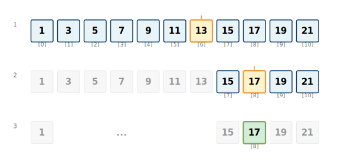

# Basic Searching

Open your Contacts app. Type "Alex." Before you finish typing the name, it's found. With 500+ contacts, how does it work so fast? This is binary search in action—the same algorithm that powers Spotlight, finds songs in Apple Music's 100-million track library, and locates your fastest mile split across years of running data in the Health app.

In [Chapter 2](02-measuring-performance.md) we learned the vocabulary of performance—Big O notation provides a common language for discussing algorithmic efficiency. Now it's time to apply that knowledge to your first concrete [algorithms](https://en.wikipedia.org/wiki/Algorithm). Whether we're building a contact app, a fitness tracker, a music library, or any system that manages information, search functionality is essential.

In this chapter, we'll explore two fundamental approaches to searching: linear search and [binary search](https://en.wikipedia.org/wiki/Binary_search_algorithm). We'll learn how each algorithm works, when to use it, and why the choice between `O(n)` and `O(log n)` makes such a dramatic difference as data grows.

## The search problem

At its core, searching involves answering a simple question: "Is this item in my collection?" However, the method you choose to answer this question can mean the difference between a lightning-fast response and a painfully slow operation.

Consider these real-world scenarios:
- Finding a contact in your phone's address book
- Locating your personal record time for a specific distance in a running app
- Searching for a word in a dictionary
- Looking up which workout had the highest calorie burn in the Health app
- Finding a specific song in a playlist of thousands

Each scenario involves the same fundamental challenge, but the optimal approach depends on how the data is organized. An unsorted list of workouts requires checking each one. A sorted list lets you jump directly to the timeframe you're seeking.

## The brute force approach

We've already encountered [linear search](https://en.wikipedia.org/wiki/Linear_search) in our Big O chapter, but let's examine it more thoroughly. Linear search represents the most straightforward approach to finding data: check every item until we find what we're looking for.

```swift
// Implement linear search as an Array extension using Equatable protocol
extension Array where Element: Equatable {
    // Search for an element using linear search, returning its index if found
    func linearSearch(for target: Element) -> Int? {

        for (index, element) in enumerated() {
            if element == target {
                return index
            }
        }

        return nil
    }
}

//test with unsorted data
let numbers = [64, 34, 25, 12, 22, 11, 90, 5]
if let index = numbers.linearSearch(for: 22) {
    print("Found 22 at index \(index)")
} else {
    print("22 not found")
}
```

### When linear search shines

Linear search has several advantages that make it valuable in certain situations:

1. **Works with any data** - Sorted or unsorted, it doesn't matter
2. **Simple to implement** - Minimal chance of bugs
3. **Consistent performance** - No best or worst case surprises
4. **Memory efficient** - Uses no additional storage

## Linear search performance analysis

As we learned in the Big O chapter, linear search operates in `O(n)` time. But let's break down what this means in practice:

```swift
// Perform linear search while tracking the number of comparisons made
func analyzedLinearSearch<T: Equatable>(for target: T, in array: [T]) -> (index: Int?, comparisons: Int) {
    var comparisons = 0

    for (index, element) in array.enumerated() {
        comparisons += 1
        if element == target {
            return (index, comparisons)
        }
    }

    return (nil, comparisons)
}

let testData = [5, 2, 8, 6, 1, 9, 4, 0, 3, 7]

//best case: target is first element
let (_, bestCase) = analyzedLinearSearch(for: 5, in: testData)
print("Best case: \(bestCase) comparisons")

//average case: target in middle
let (_, avgCase) = analyzedLinearSearch(for: 1, in: testData)
print("Average case: \(avgCase) comparisons")

//worst case: target not found
let (_, worstCase) = analyzedLinearSearch(for: 15, in: testData)
print("Worst case: \(worstCase) comparisons")
```

This analysis reveals that while linear search is `O(n)` in the worst case, real-world performance varies significantly based on where the target is located.


## Divide and conquer

When the data is sorted, we can employ a much more efficient strategy. Binary search uses the [divide and conquer](https://en.wikipedia.org/wiki/Divide-and-conquer_algorithm) approach, eliminating half of the remaining possibilities with each comparison.

### The phone book analogy

Imagine we're looking for "Smith" in a physical phone book. You wouldn't start from page 1 and flip through every page. Instead, you'd:

1. Open to the middle of the book
2. See if "Smith" comes before or after the names on that page
3. Eliminate half the book and repeat the process
4. Continue until we find "Smith" or determine it's not there

This intuitive process is exactly how binary search works. Or consider finding a specific workout date in your fitness app's history. If your 500 workouts are sorted chronologically, you wouldn't scroll from the beginning. You'd jump to roughly where you think June 2023 should be, see if you're too early or too late, then narrow down from there. This halving strategy is binary search.



## Binary search implementation

```swift
// Implement binary search as an Array extension using Comparable protocol
extension Array where Element: Comparable {
    // Search for an element using binary search on a sorted array
    func binarySearch(for target: Element) -> Int? {
        var leftIndex = 0
        var rightIndex = count - 1

        while leftIndex <= rightIndex {
            let middleIndex = (leftIndex + rightIndex) / 2
            let middleValue = self[middleIndex]

            if middleValue == target {
                return middleIndex
            } else if middleValue < target {
                //target is in right half
                leftIndex = middleIndex + 1
            } else {
                //target is in left half
                rightIndex = middleIndex - 1
            }
        }

        return nil
    }
}

//test with sorted data
let sortedNumbers = [1, 3, 5, 7, 9, 11, 13, 15, 17, 19, 21, 23, 25]
if let index = sortedNumbers.binarySearch(for: 17) {
    print("Found 17 at index \(index)")
} else {
    print("17 not found")
}
```

## Understanding binary search performance

Binary search achieves `O(log n)` [time complexity](https://en.wikipedia.org/wiki/Time_complexity). This logarithmic performance means that doubling the data size only adds one more step to the search process.

```swift
// Perform binary search while tracking comparisons and printing each step
func analyzedBinarySearch<T: Comparable>(for target: T, in array: [T]) -> (index: Int?, comparisons: Int) {
    var comparisons = 0
    var leftIndex = 0
    var rightIndex = array.count - 1

    while leftIndex <= rightIndex {
        comparisons += 1
        let middleIndex = (leftIndex + rightIndex) / 2
        let middleValue = array[middleIndex]

        print("Step \(comparisons): Checking index \(middleIndex) (value: \(middleValue))")

        if middleValue == target {
            return (middleIndex, comparisons)
        } else if middleValue < target {
            leftIndex = middleIndex + 1
        } else {
            rightIndex = middleIndex - 1
        }
    }

    return (nil, comparisons)
}

let largeSortedArray = Array(1...1000)
let (foundIndex, steps) = analyzedBinarySearch(for: 750, in: largeSortedArray)
print("Found 750 at index \(foundIndex ?? -1) in \(steps) steps")
```

### The power of logarithmic time

The efficiency of binary search becomes remarkable with large datasets. Consider a fitness app storing years of workout history.

**Note:** These numbers represent the maximum comparisons needed in the worst-case scenario:

| Workout Count | Linear Search (worst) | Binary Search (worst) | Real-World Example |
|---------------|----------------------|----------------------|-------------------|
| 100 | 100 comparisons | 7 comparisons | 3 months of daily workouts |
| 1,000 | 1,000 comparisons | 10 comparisons | ~3 years of workouts |
| 10,000 | 10,000 comparisons | 14 comparisons | Decade of fitness data |
| 1,000,000 | 1,000,000 comparisons | 20 comparisons | Professional athlete's career |

This table demonstrates why binary search is preferred for large, sorted datasets. The logarithmic growth means that even massive collections—like Apple Health's database of every step you've taken for years—can be searched in a reasonable number of steps. A million entries require just 20 comparisons with binary search versus potentially a million with linear search.

## Sorted data

Binary search's efficiency comes with an important prerequisite: the data must be sorted. This requirement influences how you design your data management strategy.

```swift
//demonstrating the sorted data requirement
let unsortedData = [64, 34, 25, 12, 22, 11, 90, 5]
let sortedData = unsortedData.sorted()

//binary search on unsorted data may give incorrect results
print("Searching unsorted data for 22:")
if let index = unsortedData.binarySearch(for: 22) {
    print("Binary search claims 22 is at index \(index)")
    print("But actually 22 is at index \(unsortedData.firstIndex(of: 22)!)")
} else {
    print("Binary search couldn't find 22 in unsorted data")
}

//binary search on sorted data works correctly
print("\nSearching sorted data for 22:")
if let index = sortedData.binarySearch(for: 22) {
    print("Found 22 at index \(index) in sorted array")
}
```

## Choosing the right search strategy

The decision between linear and binary search depends on several factors:

### Use linear search when:
- **Data is unsorted** and sorting is expensive
- **Small datasets** where the overhead of sorting isn't worth it
- **Frequently changing data** where maintaining sorted order is costly
- **Simple implementation** is more important than optimal performance

### Use binary search when:
- **Data is already sorted** or we can afford to sort it
- **Large datasets** where the logarithmic advantage is significant
- **Read-heavy operations** where searches are more frequent than modifications
- **Performance is critical** and we can maintain sorted order

## Practical considerations

Consider a contact application where users frequently search for names but rarely add new contacts. Sorting the contacts once and using binary search for all subsequent lookups would be more efficient than using linear search repeatedly.

Similarly, in a fitness app where users regularly query their workout history ("What was my fastest 5K?", "When did I last run 10 miles?"), keeping workouts sorted by date or distance enables binary search. The cost of maintaining sorted order pays off quickly when searches outnumber insertions—which is typical for historical fitness data.

```swift
// Contact struct for demonstrating binary search in a contact manager application
struct Contact {
    let name: String
    let phone: String
}

// Conform Contact to Comparable protocol to enable binary search by name
extension Contact: Comparable {
    static func < (lhs: Contact, rhs: Contact) -> Bool {
        return lhs.name < rhs.name
    }

    static func == (lhs: Contact, rhs: Contact) -> Bool {
        return lhs.name == rhs.name
    }
}

class ContactManager {
    private var contacts: [Contact] = []

    // Add a new contact and maintain sorted order for efficient searching
    func addContact(_ contact: Contact) {
        contacts.append(contact)
        //keep contacts sorted for efficient searching
        contacts.sort { $0.name < $1.name }
    }

    // Find a contact by name using binary search
    func findContact(named name: String) -> Contact? {
        let searchContact = Contact(name: name, phone: "")

        if let index = contacts.binarySearch(for: searchContact) {
            return contacts[index]
        }

        return nil
    }
}
```

## Memory vs. time trade-offs

Sometimes we might maintain both sorted and unsorted versions of your data, trading memory for faster access patterns:

```swift
// Dual-array data structure trading memory for fast search and insertion-order access
class OptimizedDataStore<T: Comparable> {
    private var insertionOrder: [T] = []  //for maintaining order of addition
    private var sortedData: [T] = []      //for fast searching

    // Add an item to both insertion-order and sorted arrays
    func add(_ item: T) {
        insertionOrder.append(item)

        //insert into sorted position
        let insertIndex = sortedData.binarySearchInsertionPoint(for: item)
        sortedData.insert(item, at: insertIndex)
    }

    // Search for an item using binary search on the sorted array
    func search(for item: T) -> Bool {
        return sortedData.binarySearch(for: item) != nil
    }

    // Return items in their original insertion order
    func itemsInOrder() -> [T] {
        return insertionOrder
    }
}

extension Array where Element: Comparable {
    // Find the correct insertion point to maintain sorted order
    func binarySearchInsertionPoint(for target: Element) -> Int {
        var leftIndex = 0
        var rightIndex = count

        while leftIndex < rightIndex {
            let middleIndex = (leftIndex + rightIndex) / 2

            if self[middleIndex] < target {
                leftIndex = middleIndex + 1
            } else {
                rightIndex = middleIndex
            }
        }

        return leftIndex
    }
}
```

## Building algorithmic intuition

Searching algorithms demonstrate a fundamental trade-off in computer science: simplicity versus efficiency. Linear search works on any data with minimal assumptions, while binary search requires sorted data but achieves logarithmic performance. This pattern—trading preparation cost for execution speed—appears throughout algorithm design. The divide-and-conquer strategy behind binary search generalizes to quicksort ([Chapter 5](05-advanced-sorting.md)), binary search trees ([Chapter 11](11-binary-search-trees.md)), and many efficient algorithms throughout this book.
