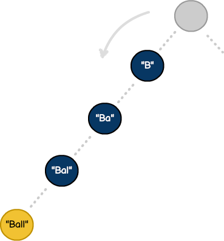
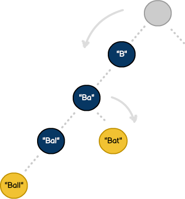

# Tries

Tries are data structures that organize information in a hierarchy. Often pronounced "try", the term comes from the English language verb to retrieve. While most algorithms are designed to manipulate generic data, tries are commonly used with `Strings`.

While binary search trees store values in nodes and have two children (`left` and `right`), tries store characters in `nodes` and can have many children (one per character in the alphabet). This makes tries exceptionally efficient for prefix-based operations like autocomplete—a task that would require `O(n)` time with other data structures but takes only `O(p)` time with tries, where p is the prefix length.

Similar to graphs from [Chapter 13](13-graphs.md), tries demonstrate how combining algorithmic techniques creates specialized solutions. Our implementation uses breadth-first search ([Chapter 13](13-graphs.md)) with `Queue` structures ([Chapter 10](10-stacks-and-queues.md)) to efficiently traverse the trie hierarchy and collect all words matching a prefix.

## How it works

As discussed, tries organize data in a hierarchy. To see how they work, let's build a `Dictionary` that contains the following words:

- Ball
- Balls
- Ballard
- Bat
- Bar
- Cat
- Dog

At first glance, we see words prefixed with the phrase "Ba", while entries like "Ballard" combine words and phrases (e.g., "Ball" and "Ballard"). Even though our dictionary contains a limited quantity of words, a thousand-item list would have the same characteristics. As with any algorithm, we'll apply our knowledge to build an efficient model.

Tries involve building hierarchies, storing phrases along the way until a word is created. With so many permutations, it's important to know what qualifies as an actual word. For example, even though we've stored the phrase "Ba", it's not identified as a word until explicitly marked.

## The data structure

Here's our Trie data structure. Note our TrieNode uses array for storing related child records. This approach prioritizes simplicity and memory efficiency over individual lookup speed:

```swift
// Trie node with array-based children storage
public class TrieNode {

    var tvalue: String?          // The accumulated string value at this node
    var children: Array<TrieNode>  // Array of child nodes
    var isFinal: Bool             // True if this node represents a complete word
    var level: Int                // Depth in the tree (0 for root)

    // Initializes an empty trie node at level 0
    public init() {
        self.children = Array<TrieNode>()
        self.isFinal = false
        self.level = 0
    }
}

// Trie structure for efficient prefix-based string operations
public class Trie {
    private var root = TrieNode()

    // Creates a new empty trie
    public init() {}
}
```

The array-based children approach trades `O(1)` dictionary lookup for `O(k)` array iteration (where k is the number of children), but gains simplicity and reduces memory overhead. For typical use cases with small branching factors, this trade-off is reasonable.

## Adding words

Using the TrieNode data structure, we can add words to our trie using the `append(word:)` method. This implementation builds the tree character by character, creating nodes as needed:

<figure>
  
  <figcaption>Figure 14.1: Inserting "ball" creates one node per character, with the terminal node marking a valid word.</figcaption>
</figure>

```swift
// Inserts a word into the trie character by character
func append(word keyword: String) {
    // Trivial case
    guard keyword.length > 0 else {
        return
    }

    var current: TrieNode = root

    while keyword.length != current.level {
        var childToUse = TrieNode()
        let searchKey = keyword.substring(to: current.level + 1)

        // Iterate through child nodes to find matching prefix
        for child in current.children {
            if child.tvalue == searchKey {
                childToUse = child
                break
            }
        }

        // Create new node if prefix doesn't exist
        if childToUse.tvalue == nil {
            childToUse.tvalue = searchKey
            childToUse.level = current.level + 1
            current.children.append(childToUse)
        }

        current = childToUse
    }

    // Final end of word check
    if keyword.length == current.level {
        current.isFinal = true
        print("end of word reached!")
        return
    }
}

// Example: Build trie from word list
let trie = Trie()
let words = ["ball", "balls", "ballard", "bat", "bar", "cat", "dog"]

for word in words {
    trie.append(word: word)
}
```

Insertion is `O(m)` where m is the word length. The algorithm navigates through existing nodes for shared prefixes, only creating new nodes when necessary. This prefix-sharing is what makes tries memory-efficient despite storing many words.

## Breadth-first search for trie operations

The primary advantage of tries is efficient prefix-based searching. Our production implementation uses breadth-first search (BFS) from [Chapter 13](13-graphs.md) to traverse the trie hierarchy and collect matching words. This demonstrates how graph traversal algorithms apply to tree structures—the same BFS pattern that worked for graph exploration works equally well for tree operations.

### The breadth-first pattern

All trie search operations follow a consistent BFS pattern with two phases. In the first phase, we navigate to a starting node by finding the specific node where the search begins (such as a prefix node or the root), validating that the starting point exists, and returning early if the search is impossible.

<figure>
  
  <figcaption>Figure 14.2: Adding "bat" branches off the existing "ba" prefix rather than duplicating it.</figcaption>
</figure>

In the second phase, we perform a level-order traversal. We initialize a Queue and enqueue the starting node, then process all nodes at level N before moving to level `N+1`. At each node we check a condition—collecting a word, matching a pattern, or performing some other operation—and enqueue the node's children for the next level. The Queue from [Chapter 10](10-stacks-and-queues.md) acts as a "to-visit" list, ensuring systematic exploration. This guarantees we find all matching words without missing any branches.

### Why breadth-first search

BFS is exploratory — it visits every reachable node without needing to know or program all possible search permutations in advance. Once we navigate to a prefix node, BFS fans out and discovers every descendant, which is exactly what autocomplete requires. We cannot predict how many words share a prefix or how deep they extend, but BFS handles this naturally by continuing until it runs out of nodes to explore. 

### Autocomplete with traverse

The `traverse(using:)` method demonstrates the BFS pattern for autocomplete suggestions:

```swift
// Finds all complete words matching a keyword prefix using BFS
func traverse(using keyword: String) -> Array<String>? {
    // Trivial case
    guard keyword.length > 0 else {
        return nil
    }

    var current: TrieNode = root
    var wordList = Array<String>()

    // Phase 1: Navigate to the prefix node
    while keyword.length != current.level {
        let searchKey = keyword.substring(to: current.level + 1)
        var isFound: Bool = false

        // Iterate through any child nodes
        for child in current.children {
            if child.tvalue == searchKey {
                current = child
                isFound = true
                break
            }
        }

        if isFound == false {
            return nil  // Prefix not found
        }
    }

    // Phase 2: BFS process from the prefix node
    let trieQueue: Queue<TrieNode> = Queue<TrieNode>()

    // Queue the starting node (represents the prefix)
    trieQueue.enQueue(current)

    while !trieQueue.isEmpty() {
        // Traverse the next queued node
        guard let leaf = trieQueue.deQueue() else {
            break
        }

        // Add unvisited trie nodes to the queue
        for e in leaf.children {
            let leafValue = e.tvalue ?? "nil"
            print("adding leaf: \(leafValue) to queue..")
            trieQueue.enQueue(e)
        }

        // If this node represents a complete word, add it to results
        if leaf.isFinal == true {
            if let tvalue = leaf.tvalue {
                wordList.append(tvalue)
            }
        }

        let leafValue = leaf.tvalue ?? "nil"
        print("traversed substring: \(leafValue)..")
    }

    print("trie traversal complete..")

    return wordList
}

// Example: Get autocomplete suggestions
if let suggestions = trie.traverse(using: "ba") {
    print("Autocomplete for 'ba': \(suggestions)")
    // Outputs: ["ball", "balls", "ballard", "bar", "bat"]
} else {
    print("No matches found")
}
```

The method combines both phases: navigate to prefix (`O(p)` where p is prefix length), then BFS to collect all descendant words (`O(n)` where n is the number of matching words). Total complexity is `O(p + n)`.

### Pattern matching with filter

The same BFS pattern applies to more complex queries. The [Structures package](https://github.com/waynewbishop/bishop-algorithms-swift-package) includes a `filter` method that finds words matching both start AND end characters:

```swift
// Checks if the trie contains a word with specified start and end characters
func filter(_ start: String, _ end: String) -> Bool {
    let current: TrieNode = root
    var isFirst: Bool = false

    // Check if any word starts with the specified character
    for child in current.children {
        if let tvalue = child.tvalue {
            if tvalue == start {
                isFirst = true
                break
            }
        }
    }

    guard isFirst == true else {
        return false
    }

    // BFS to find word ending with specified character
    let trieQueue: Queue<TrieNode> = Queue<TrieNode>()
    trieQueue.enQueue(current)

    while !trieQueue.isEmpty() {
        // Traverse the next queued node
        guard let leaf = trieQueue.deQueue() else {
            break
        }

        // Add unvisited trie nodes to the queue
        for e in leaf.children {
            let leafValue = e.tvalue ?? "nil"
            print("adding leaf: \(leafValue) to queue..")
            trieQueue.enQueue(e)
        }

        // Check for qualifying value
        if leaf.isFinal == true {
            if let tvalue = leaf.tvalue {
                if tvalue.last == Character(end) {
                    return true
                }
            }
        }

        if let tvalue = leaf.tvalue {
            print("traversed leaf: \(tvalue)..")
        }
        else {
            print("traversed root..")
        }
    }

    print("traversal complete..")
    return false
}

// Example: Check if any word starts with "b" and ends with "t"
if trie.filter("b", "t") {
    print("Found word starting with 'b' and ending with 't'")
    // True: "bat" matches this pattern
}
```

Both methods use identical BFS structure—the while loop, Queue operations, and child iteration are the same. Only the processing logic differs. The `traverse` method collects all `isFinal` nodes and returns `Array<String>?`, while `filter` checks if any `isFinal` node matches an end character and returns `Bool`. This demonstrates how BFS provides a flexible, reusable pattern for trie operations. Once we understand the BFS template, we can apply it to any trie traversal problem by changing just the node processing logic.

## Using the subscript shortcut

The production Trie includes a convenient subscript operator that calls `traverse` internally:

```swift
// Provides array-like syntax for prefix searches
subscript(word: String) -> Array<String>? {
    get {
        return traverse(using: word)
    }
}

// Example: Cleaner syntax for autocomplete
if let suggestions = trie["ba"] {
    print("Words starting with 'ba': \(suggestions)")
}

// Check if prefix exists
if trie["cat"] != nil {
    print("Found words starting with 'cat'")
}
```

## Performance analysis

Tries offer excellent performance characteristics for string operations, with complexity independent of dictionary size (from [Chapter 8](08-performance-analysis.md) analysis):

### Time complexity

Inserting a word with `append` runs in `O(m)` where m is the word length, since we visit one node per character. Searching for a prefix with `traverse` has two phases: navigating to the prefix node takes `O(p)` where p is the prefix length, and the BFS traversal to collect results takes `O(k)` where k is the number of nodes in the subtree. The total autocomplete complexity is `O(p + k)`.

### Space complexity

On average, a trie uses `O(N × M)` space where N is the number of words and M is the average word length. In the worst case where no prefixes are shared, space grows to `O(ALPHABET_SIZE × N × M)`. In the best case where all words share a single long prefix, space reduces to `O(M)`.

### Compared to other data structures

| Operation | Hash Table (Ch 15) | Binary Search Tree (Ch 11) | Trie |
|-----------|------------|-------------------|------|
| Search exact word | `O(1)` average | `O(log n)` | `O(m)` |
| Insert | `O(1)` average | `O(log n)` | `O(m)` |
| Prefix search | `O(n)` | `O(n)` | `O(p)` |
| Autocomplete | `O(n)` | `O(n)` | `O(p + k)` |

Where m = word length, p = prefix length, k = number of results, n = total words

**Key insight**: Tries are the only structure with `O(p)` prefix search. Hash tables and BSTs must examine all n entries to find prefix matches, making tries dramatically faster for autocomplete operations.

## Building algorithmic intuition

Tries provide two essential capabilities: prefix-based searching in `O(p)` time and shared storage of common prefixes. The hierarchical structure naturally represents string relationships—autocomplete suggestions, spell checking, and network routing all benefit from navigating character-by-character rather than comparing entire strings. The BFS pattern demonstrated here generalizes beyond tries: the same breadth-first search from [Chapter 13](13-graphs.md) works identically on trees and graphs, and the Queue structure from [Chapter 10](10-stacks-and-queues.md) provides level-order traversal whether exploring social networks or collecting word suggestions.
