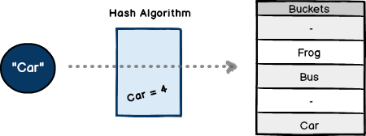

# Hash Tables

Hash tables solve a fundamental problem in computer science: how do we store and retrieve data in `O(1)` constant time? The answer lies in using a hash function to transform keys into array indices, allowing direct access to stored values.

## Keys and values

Compared to other data structures, linked lists from [Chapter 9](09-linked-lists.md) are flexible but require `O(n)` search time due to sequential traversal, and arrays offer fast indexed access but require knowing the exact position. Hash tables combine the best of both — fast `O(1)` average operations with flexible key-based access. A well-designed hash table achieves constant time for insertion, deletion, and lookup, making it one of the most efficient data structures available.

iOS apps use hash tables extensively. [UserDefaults](https://developer.apple.com/documentation/foundation/userdefaults) stores app preferences as key-value pairs for instant lookup. HTTP headers in network requests use hash table lookups. Workout tracking apps retrieve today's stats by date using hash calculations instead of iterating through all entries.

## How hashing works

A hash table consists of two essential components: the **hash function**, which transforms keys into array indices, and the **bucket array**, which stores the actual values. The hash function is the heart of any hash table. It takes an input key and produces a numeric hash value that determines where to store the data.

Values are stored in non-contiguous slots called **buckets** within an array. The hash function determines which bucket to use, enabling direct access without searching through the entire structure. Unlike a dictionary, the computed index is not stored alongside the data — it can be recalculated at any time from the key itself.

<figure>
  
  <figcaption>Figure 15.1: A hash function maps each key to a bucket index, turning lookup into constant-time math.</figcaption>
</figure>

## The Indexable protocol

An interesting question arises when building a generic hash table. Since elements are arranged based on their hash index, how can our algorithm learn to interpret different data types? To manage these requirements, the `Structures` package defines a protocol called `Indexable`:

```swift
// Requires conforming types to provide a numeric hash representation
public protocol Indexable: Hashable {
    var asciiRepresentation: Int {get}
}
```

The `Indexable` protocol extends `Hashable` and requires a single computed property — `asciiRepresentation` — that converts the type's content into an integer suitable for hash table indexing. Here's how `String` conforms to this requirement:

```swift
// Computes a hash value by summing unicode scalar values
extension String: Indexable {
    public var asciiRepresentation: Int {
        var divisor: Int = 0
        for item in self.unicodeScalars {
            divisor += Int(item.value)
        }
        return divisor
    }
}
```

This approach converts each character to its unicode scalar value and sums them together. The string "Swift" produces a sum of its character values (83 + 119 + 105 + 102 + 116 = 525). This numeric representation becomes the input to our hash function.

### Educational example

Our `asciiRepresentation` is an educational hash function designed to illustrate the core mechanics of hashing. Production systems use far more sophisticated algorithms — [MD5](https://en.wikipedia.org/wiki/MD5), [SHA-256](https://en.wikipedia.org/wiki/SHA-2), and [SipHash](https://en.wikipedia.org/wiki/SipHash) (which Swift's standard library uses internally) all employ advanced techniques to minimize collisions. These algorithms are beyond the scope of this book, but the fundamental principle remains the same: transform input into a numeric index.

## Building a basic hash set

With the `Indexable` protocol in place, we can build our first hash table. `HashSet` is the simplest implementation — it stores elements directly in buckets with no collision handling. When two elements hash to the same index, insertion simply fails:

```swift
// Basic hash table storing unique elements without collision handling
public class HashSet<T: Indexable> {

    // Array of buckets for storing elements
    private var buckets: Array<T?>

    // Number of remaining empty slots in the hash table
    private var slots: Int = 0

    // Creates a new empty hash set with the specified initial capacity
    public init(capacity: Int = 20) {
        self.buckets = Array<T?>(repeatElement(nil, count: capacity))
        self.slots = buckets.capacity
    }
}
```

The `buckets` array holds optional elements — each position is either `nil` (empty) or contains a single value. The `slots` counter tracks remaining capacity to know when the table needs more space.

### The hash function

The hash function is where mathematics replaces searching. It takes an element's `asciiRepresentation` and uses the modulo operator to wrap it into a valid bucket index:

```swift
// Computes the hash index for an element using modulo-based hashing
private func hash(_ element: T) -> Int {
    var remainder: Int = 0
    remainder = element.asciiRepresentation % buckets.count
    return remainder
}
```

The modulo operation ensures the result falls within `0..<buckets.count`, regardless of how large the ascii representation is. The string "Swift" with an ascii sum of 525 placed into a 20-bucket table would hash to index `525 % 20 = 5`.

### Inserting elements

With the hash function defined, insertion computes the hash and places the element directly into the corresponding bucket:

```swift
// Inserts an element if its hash index is unoccupied
public func insert(_ element: T) -> Bool {

    //compute hash value
    let hvalue = self.hash(element)

    if buckets[hvalue] == nil {
        buckets[hvalue] = element
        slots -= 1

        //determine if more slots are needed
        if slots == 1 {
            buckets.append(nil)
            slots = 1
        }

        return true
    }

    else {
        //separate chaining..
    }

    return false
}
```

When the bucket is empty, the element is stored and `slots` is decremented. If only one slot remains, a new bucket is appended to maintain capacity. The `else` branch is where collision handling would go — but in `HashSet`, the method simply returns `false`. The comment hints at the solution we'll implement next.

### Finding elements

Looking up an element follows the same pattern — compute the hash and check the corresponding bucket:

```swift
// Checks whether an element exists in the hash set
public func contains(_ element: T) -> Bool {

    //compute hash value
    let hvalue = self.hash(element)

    guard buckets[hvalue] != nil else {
        return false
    }

    return true
}
```

This is why hash tables achieve `O(1)` lookup. Instead of iterating through every element like a linked list, we compute a single hash value and jump directly to the answer.

## Discovering collisions

The creation of hash algorithms is considered more art than science. With `HashSet`, our straightforward modulo-based hash function works well until two different inputs produce the same index. Consider what happens when we insert the names "Albert Einstein" and "Andrew Collins" into a table with 20 buckets.

Computing the ascii representation for "Albert Einstein" sums the unicode scalar values of each character to produce 1451. The modulo operation yields `1451 % 20 = 11`. Computing the same for "Andrew Collins" produces a different sum, but `% 20` also yields 11. Both names hash to the same bucket — a collision. Since `HashSet` stores only one element per bucket, the second insertion fails and returns `false`.

This limitation is not rare. As more elements fill the table, collisions become increasingly likely. We need a strategy that allows multiple elements to share the same bucket index.

## Separate chaining

To handle collisions, we introduce a supporting data structure: a singly-linked list called `Chain`. Each bucket will hold a chain instead of a single element, allowing multiple values at the same index:

```swift
// Singly-linked list for hash table collision resolution
public class Chain<T: Equatable> {

    // Reference to the first node in the chain
    private var head = LLNode<T>()

    // Cached value of the last element for O(1) tail access
    private var lastvalue: T?

    // Creates a new empty chain
    public init() {
        //package support
    }

    // Returns the last value in the chain without traversing
    var last: T? {
        return lastvalue
    }

    // Returns all values stored in the chain as an array
    public var values: Array<T> {
        var current: LLNode? = head
        var results = Array<T>()

        while let item = current {
            if let tvalue = item.tvalue {
                results.append(tvalue)
            }
            current = item.next
        }

        return results
    }
}
```

The `Chain` class uses `LLNode` from [Chapter 9](09-linked-lists.md) to build a forward-linked list. Each node holds a value and a reference to the next node in the chain. The `values` property traverses the entire chain and collects all stored elements into an array.

### Adding and finding chain elements

The chain supports two essential operations — appending new values and checking whether a value exists:

```swift
// Appends a new value to the end of the chain
public func append(_ tvalue: T) {

    guard head.tvalue != nil else {
        head.tvalue = tvalue
        lastvalue = tvalue
        return
    }

    let childToUse = LLNode<T>()
    childToUse.tvalue = tvalue

    var current: LLNode<T> = head

    //find next position - O(n)
    while let item = current.next {
        current = item
    }

    childToUse.previous = current
    current.next = childToUse

    lastvalue = tvalue
}

// Checks whether a specific value exists in the chain
public func contains(_ tvalue: T) -> Bool {

    var current: LLNode<T>? = head

    //find possible match - O(n)
    while current != nil {
        if let item = current {
            if let chainValue = item.tvalue {
                if chainValue == tvalue {
                    return true
                }
            }
            current = item.next
        }
    }

    return false
}
```

The `append` method traverses to the end of the chain and links a new node. The `contains` method walks the chain comparing each value until it finds a match or exhausts all nodes. Both operations are `O(k)` where k is the chain length — but since well-distributed hash functions keep chains short, this remains fast in practice.

## Solving collisions with HashChain

With the `Chain` data structure in place, we can build `HashChain` — a hash table that handles collisions through separate chaining. The structure mirrors `HashSet`, but each bucket now holds an optional `Chain` instead of a single element:

```swift
// Hash table with collision resolution via separate chaining
public class HashChain<T: Indexable> {

    // Number of remaining empty buckets in the hash table
    private var slots: Int = 0

    // Array of bucket chains for storing colliding elements
    var buckets: Array<Chain<T>?>

    // Creates a new empty hash table with separate chaining
    public init(capacity: Int = 20) {
        self.buckets = Array<Chain<T>?>(repeatElement(nil, count: capacity))
        self.slots = buckets.capacity
    }
}
```

### Inserting with collision handling

The `insert` method now handles both cases — empty buckets and collisions:

```swift
// Inserts an element, handling collisions via separate chaining
public func insert(_ element: T) {

    //compute hash value
    let hvalue = self.hash(element)

    if buckets[hvalue] == nil {

        //new chain
        let chain = Chain<T>()
        chain.append(element)

        buckets[hvalue] = chain
        slots -= 1

        if slots == 1 {
            buckets.append(nil)
            slots = 1
        }

    }
    else {
        print("collision detected!")

        //use existing chain
        if let chain = buckets[hvalue] {
            if chain.contains(element) == false {
                chain.append(element)
            }
        }

    }

}
```

When a bucket is empty, the method creates a new `Chain`, appends the element, and stores the chain at the computed index. When a collision occurs — the bucket already has a chain — the element is appended to the existing chain after checking for duplicates. Unlike `HashSet`, no element is rejected. Both "Albert Einstein" and "Andrew Collins" now coexist at bucket 11, linked together in a chain.

### Collision-aware lookup

The `contains` method delegates to the chain's own `contains` method for collision-aware searching:

```swift
// Checks whether an element exists in the hash table
public func contains(_ element: T) -> Bool {

    //compute hash value
    let hvalue = self.hash(element)

    guard let chain = buckets[hvalue] else {
        return false
    }

    return chain.contains(element)
}
```

If the bucket is empty, the element cannot exist and we return `false` immediately. If a chain exists at the computed index, we search through it for the target value. The hash function narrows the search to a single bucket, and the chain handles the rest.

### The hash function

`HashChain` uses the same hash function as `HashSet` — the only difference is how collisions are handled after the hash is computed:

```swift
// Computes the hash index for an element using modulo-based hashing
private func hash(_ element: T) -> Int {
    var remainder: Int = 0
    remainder = element.asciiRepresentation % buckets.count
    return remainder
}
```

## Performance analysis

Hash tables offer excellent performance characteristics when properly implemented, as analyzed using [Chapter 8](08-performance-analysis.md) principles. In the average case, insert, search, and delete all run in `O(1)` time. The worst case degrades to `O(n)` when all keys hash to the same bucket, forming a single long chain. Space complexity is `O(n)` where n is the number of stored elements.

The ratio of stored elements to bucket count is called the **load factor**. A load factor below 0.75 generally maintains `O(1)` performance. As the load factor increases, chains grow longer and performance approaches `O(n)`. Production hash tables like Swift's `Dictionary` automatically resize when the load factor exceeds a threshold, rehashing all elements into a larger bucket array to restore short chains.

### Comparison with other data structures

| Operation | Array | Linked List (Ch 9) | BST (Ch 11) | Hash Table |
|-----------|-------|-------------|-----|------------|
| Search | `O(n)` | `O(n)` | `O(log n)` | `O(1)` avg |
| Insert | `O(n)` | `O(1)` | `O(log n)` | `O(1)` avg |
| Delete | `O(n)` | `O(n)` | `O(log n)` | `O(1)` avg |
| Ordered Traversal | Yes | No | Yes | No |
| Memory Overhead | Low | Medium | Medium | Medium-High |

## Hash tables in iOS development

Every iOS app uses hash tables. Swift's `Dictionary` is a hash table, providing the same `O(1)` key-value operations we built in this chapter. Data caching provides one of the most common use cases — rather than repeatedly formatting the same distance value, cache the result:

```swift
// Cache formatted strings to avoid repeated computation
var formattedDistances = [Double: String]()

if let cached = formattedDistances[5.2] {
    return cached  // O(1) lookup
} else {
    let formatted = formatDistance(5.2)
    formattedDistances[5.2] = formatted  // O(1) store
    return formatted
}
```

Grouping data by category is another natural fit. Workout aggregation by month becomes trivial with hash table semantics:

```swift
// Group workouts by month using hash table
var workoutsByMonth = [String: [Workout]]()
workoutsByMonth["2024-01"] = [...]  // Instant grouping
```

With arrays, finding a workout by name requires checking every element — `O(n)` time. With `Dictionary`, hashing directly to the value takes `O(1)` time. For 10 workouts, the difference is negligible. For 10,000 workouts, `Dictionary` wins by orders of magnitude.

## Building algorithmic intuition

Hash tables achieve `O(1)` average-case performance through clever use of hashing and array indexing. The progression from `HashSet` to `HashChain` reveals a fundamental design pattern — start with the simplest possible solution, identify its limitations through concrete examples, then layer on complexity only where needed. Collision handling through separate chaining demonstrates how combining data structures (arrays and linked lists) creates solutions more powerful than either alone.

Hash tables complement other data structures throughout this book. Binary search trees from [Chapter 11](11-binary-search-trees.md) maintain sorted order but require `O(log n)` operations, tries from [Chapter 14](14-tries.md) excel at prefix searches, and hash tables sacrifice ordering for `O(1)` lookups. Recognizing when constant-time access matters more than ordering is a practical skill that extends to shortest path algorithms in [Chapter 16](16-shortest-paths.md) and dynamic programming in [Chapter 18](18-dynamic-programming.md).
