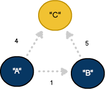
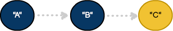
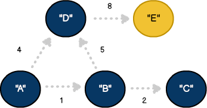
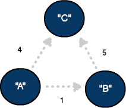
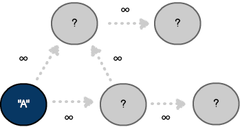
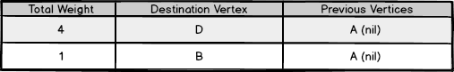
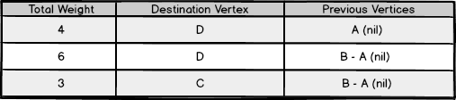
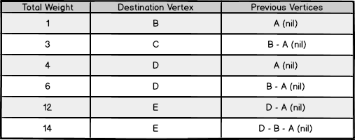

# Shortest Paths

In [Chapter 13](13-graphs.md), we saw how graphs show the relationship between two or more objects. Because of their flexibility, graphs are used in a wide range of applications including map-based services, networking and social media. Popular models may include roads, traffic, people and locations. In this chapter, we'll review how to search a graph and will implement a popular algorithm called Dijkstra's shortest path.

## Making connections

The challenge with graphs is knowing how a `vertex` relates to other objects. Consider the social networking website, LinkedIn. With LinkedIn, each profile can be thought of as a single `vertex` that may be connected with other `vertices`.

<figure>
  
  <figcaption>Figure 16.1: A weighted directed graph models real-world networks like LinkedIn connections.</figcaption>
</figure>

One feature of LinkedIn is the ability to introduce ourselves to new people. Under this scenario, LinkedIn will suggest routing a message through a shared connection. In graph theory, the most efficient way to deliver a message is called the shortest path.

## Finding our way

Shortest paths can also be seen with map-based services like Google Maps. We frequently use Google Maps to ascertain driving directions between two points. As we know, there are often multiple ways to get to any destination. The shortest route will often depend on various factors such as traffic, road conditions, accidents and time of day. In graph theory, these external factors represent edge `weights`.

<figure>
  
  <figcaption>Figure 16.2: A simple three-vertex linear path showing cumulative cost across two edges.</figcaption>
</figure>

This illustrates some key points we'll see in Dijkstra's algorithm. In addition to there being multiple ways to arrive at `vertex` C from A, the shortest path is assumed to be through `vertex` B. It's only when we arrive at `vertex` C from B that we adjust our interpretation of the shortest path and change direction (e.g. `4 < (1 + 5)`). This change in direction is known as the **greedy approach** and is used in similar problems like the traveling salesman.

<figure>
  
  <figcaption>Figure 16.3: The direct A-to-C route costs more than the indirect path through B.</figcaption>
</figure>

## Introducing Dijkstra

Edsger Dijkstra's algorithm was published in 1959 and is designed to find the shortest path between two `vertices` in a directed graph with non-negative edge `weights`. Let's review how to implement this in Swift.

Even though our model is labeled with key values and edge `weights`, our algorithm can only see a subset of this information. Starting at the source `vertex`, our goal will be to traverse the graph.

<figure>
  
  <figcaption>Figure 16.4: The five-vertex graph Dijkstra's algorithm will explore across the rest of this chapter.</figcaption>
</figure>

## Using paths

<figure>
  
  <figcaption>Figure 16.5: A weighted graph where edge values represent the cost of traversing a connection.</figcaption>
</figure>

Throughout our journey, we'll track each node visit in a custom data structure called `Path`. The `total` will manage the cumulative edge `weight` to reach a particular destination. The `previous` property will represent the `Path` taken to reach that `vertex`:

```swift
// The Path class maintains objects that comprise the frontier
public class Path<T> {

    // Cumulative cost from source to this destination
    var total: Int

    // The vertex reached by following this path
    var destination: Vertex<T>

    // Reference to previous path segment, forming a linked chain
    var previous: Path?

    // Creates a new empty path with zero cost
    public init() {
        destination = Vertex<T>()
        total = 0
    }
}
```

## Deconstructing Dijkstra

With all the graph components in place, let's see how it works. The method `processDijkstra` accepts the vertices source and destination as parameters. It also returns a `Path`. Since it may not be possible to find the destination, the return value is declared as an optional:

```swift
// Process Dijkstra's shortest path algorithm
public func processDijkstra(_ source: Vertex<T>, destination: Vertex<T>) -> Path<T>? {
    ...
}
```

## Building the frontier

As discussed, the key to understanding Dijkstra's algorithm is knowing how to traverse the graph. To help, we'll introduce a few rules and a new concept called the `frontier`:

<figure>
  
  <figcaption>Figure 16.6: Before exploration, every non-source vertex sits in the frontier with unknown cost.</figcaption>
</figure>

```swift
var frontier: Array<Path<T>> = Array<Path<T>>()
var finalPaths: Array<Path<T>> = Array<Path<T>>()

// Use source edges to populate the frontier
for e in source.neighbors {
    let newPath: Path = Path<T>()

    newPath.destination = e.neighbor
    newPath.previous = nil
    newPath.total = e.weight

    // Add the new path to the frontier
    frontier.append(newPath)
}
```

The algorithm starts by examining the source `vertex` and iterating through its list of neighbors. Recall from [Chapter 13](13-graphs.md), each neighbor is represented as an edge. For each iteration, information about the neighboring edge is used to construct a new `Path`. Finally, each `Path` is added to the `frontier`.

With our `frontier` established, the next step involves traversing the `Path` with the smallest total `weight` (e.g., B). Identifying the `bestPath` is accomplished using this linear approach:

```swift
// Construct the best path
var bestPath: Path = Path<T>()

while frontier.count != 0 {

    // Support path changes using the greedy approach - O(n)
    bestPath = Path()
    var pathIndex: Int = 0

    for x in 0..<frontier.count {
        let itemPath: Path = frontier[x]

        if (bestPath.total == 0) || (itemPath.total < bestPath.total) {
            bestPath = itemPath
            pathIndex = x
        }
    }
```

An important section to note is the while loop condition. As we traverse the graph, `Path` objects will be added and removed from the `frontier`. Once a `Path` is removed, we assume the shortest path to that destination has been found. As a result, we know we've traversed all possible paths when the `frontier` reaches zero:

```swift
    // Enumerate the bestPath edges
    for e in bestPath.destination.neighbors {
        let newPath: Path = Path<T>()

        newPath.destination = e.neighbor
        newPath.previous = bestPath
        newPath.total = bestPath.total + e.weight

        // Add the new path to the frontier
        frontier.append(newPath)
    }

    // Preserve the bestPath
    finalPaths.append(bestPath)

    // Remove the bestPath from the frontier
    frontier.remove(at: pathIndex)

} //end while
```

As shown, we've used the `bestPath` to build a new series of paths. We've also preserved our visit history with each new object.

<figure>
  
  <figcaption>Figure 16.7: After one round, two paths are known — the rest remain unreachable.</figcaption>
</figure>

At this point, we've learned a little more about our graph. There are now two possible paths to `vertex` D. The shortest path has also changed to arrive at `vertex` C. Finally, the `Path` through route A-B has been removed and has been added to a new structure named `finalPaths`.

<figure>
  
  <figcaption>Figure 16.8: Round two introduces two candidate paths to D; the cheaper one wins.</figcaption>
</figure>

## A single source

Dijkstra's algorithm can be described as "single source" because it calculates the path to every `vertex`. In our example, we've preserved this information in the `finalPaths` array:

<figure>
  
  <figcaption>Figure 16.9: The final path table holds the shortest route from A to every reachable vertex.</figcaption>
</figure>

```swift
// Establish the shortest path as an optional
var shortestPath: Path<T>? = nil

for itemPath in finalPaths {
    if (itemPath.destination == destination) {
        if (shortestPath == nil) || (itemPath.total < shortestPath!.total) {
            shortestPath = itemPath
        }
    }
}

return shortestPath
```

Based on this data, we can see the shortest path to `vertex` E from A is A-D-E. The bonus is that in addition to obtaining information for a single route, we've also calculated the shortest path to each node in the graph.

## Optimizing with heaps

Dijkstra's algorithm is an elegant solution to a complex problem. Even though we've used it effectively, our approach has a performance bottleneck. Finding the `bestPath` requires scanning every element in the `frontier` — an `O(n)` operation that executes on every iteration.

In [Chapter 17](17-heaps.md), we built a `PathHeap` that maintains the minimum-cost path at the root through heapification. By replacing the array-based `frontier` with a `PathHeap`, we transform that `O(n)` scan into an `O(1)` peek:

```swift
// Dijkstra's shortest path using heap-based frontier - O((V + E) log V)
public func processDijkstraWithHeap(_ source: Vertex<T>, destination: Vertex<T>) -> Path<T>? {

    let frontier: PathHeap = PathHeap<T>()
    let finalPaths: PathHeap = PathHeap<T>()

    // Use source edges to create the frontier
    for e in source.neighbors {
        let newPath: Path = Path<T>()

        newPath.destination = e.neighbor
        newPath.previous = nil
        newPath.total = e.weight

        // Add the new path to the frontier - O(log n)
        frontier.enQueue(newPath)
    }

    // Construct the best path
    while frontier.count != 0 {

        // Use the greedy approach to obtain the best path - O(1)
        guard let bestPath: Path = frontier.peek() else {
            break
        }

        // Enumerate the bestPath edges
        for e in bestPath.destination.neighbors {
            let newPath: Path = Path<T>()

            newPath.destination = e.neighbor
            newPath.previous = bestPath
            newPath.total = bestPath.total + e.weight

            // Add the new path to the frontier
            frontier.enQueue(newPath)
        }

        // Preserve the bestPaths that match destination
        if (bestPath.destination == destination) {
            finalPaths.enQueue(bestPath)
        }

        // Remove the bestPath from the frontier
        frontier.deQueue()
    }

    // Obtain the shortest path from the heap
    var shortestPath: Path? = Path<T>()
    shortestPath = finalPaths.peek()

    return shortestPath
}
```

The structure is nearly identical to our array-based version, but the performance characteristics change dramatically. Instead of scanning all `frontier` paths, we simply `peek` at the heap's root. Enqueuing new paths costs `O(log n)` as the heap maintains its ordering through bottom-up heapification. The overall time complexity improves from `O(V²)` to `O((V + E) log V)` — a substantial improvement for large graphs.

| Implementation | Find min | Insert | Time complexity | Best for |
|---------------|----------|--------|-----------------|----------|
| Array-based | `O(V)` scan | `O(1)` | `O(V²)` | Small graphs |
| Heap-based | `O(1)` peek | `O(log V)` | `O((V + E) log V)` | Large graphs |

## Building algorithmic intuition

Dijkstra's algorithm demonstrates greedy problem-solving: making locally optimal choices at each step leads to globally optimal solutions. The `frontier` concept — maintaining paths at the boundary of explored territory — appears throughout graph algorithms and search problems. By always selecting the shortest known path and expanding from there, the algorithm builds up globally optimal routes without exhaustively checking every combination.

The progression from array-based to heap-based implementation reveals a pattern we'll see throughout algorithm design: choosing the right data structure can transform an algorithm's scalability. The same greedy logic powers both versions, but replacing a linear scan with a priority queue from [Chapter 17](17-heaps.md) changes `O(V²)` into `O((V + E) log V)`. Understanding this relationship between data structures and algorithm performance is one of the most practical skills in computer science.
