# Mermaid Diagram Guide for Swift Algorithms Book

**Status:** ✅ Implemented and tested in Chapter 3
**Date:** October 9, 2025

---

## What is Mermaid?

Mermaid is a text-based diagramming tool that renders beautiful diagrams from simple markdown-like syntax. It's perfect for technical books because:

- ✅ **Version Control Friendly** - Text files, not binary images
- ✅ **Easy to Edit** - Update diagrams by editing text
- ✅ **Professional Quality** - Looks great on GitHub Pages
- ✅ **Responsive** - Scales perfectly on mobile devices
- ✅ **Accessible** - Works with screen readers
- ✅ **Dark Mode Support** - Automatically adapts to user preference

---

## Implementation Status

### ✅ Completed Setup

1. **Mermaid CDN Integration** - Added to `_layouts/default.html`
2. **Apple-Style Theme** - Configured with SF Pro font and iOS colors
3. **Custom CSS** - Added to `assets/css/style.scss` with dark mode support
4. **Test Implementation** - 4 diagrams added to Chapter 3

### 🎨 Apple Design System Colors

The diagrams use iOS color palette for consistency:

```
Primary (Start/End):    #007aff (Blue)
Success (Found):        #34c759 (Green)
Decision (Choices):     #ff9500 (Orange)
Error (Not Found):      #ff3b30 (Red)
Alternative Path:       #5856d6 (Purple)
Neutral:                #86868b (Gray)
```

---

## How to Add Diagrams to Chapters

### Basic Syntax

Simply add a code block with `mermaid` as the language:

````markdown

````

### Available Diagram Types

#### 1. Flowcharts (Most Common)

Best for: Algorithm flows, decision trees, process diagrams


**Shape Reference:**
- `[Rectangle]` - Process/action
- `{Diamond}` - Decision/choice
- `([Rounded])` - Start/end
- `[[Subroutine]]` - Function call

#### 2. Graph Diagrams

Best for: Data structure visualization, tree structures


#### 3. Sequence Diagrams

Best for: Algorithm interactions, step-by-step processes


#### 4. Subgraphs (Step-by-Step)

Best for: Showing algorithm progression


---

## Chapter 3 Examples

### Example 1: Linear Search Flowchart

Location: After "The brute force approach" heading


**When to use:** Algorithm flow with loops and conditionals

---

### Example 2: Binary Search Flowchart

Location: After "The phone book analogy"

```mermaid
flowchart TD
    Start([Start: Search in sorted array]) --> Init[Set left = 0<br/>right = array length - 1]
    Init --> Check{left ≤ right?}
    Check -->|No| NotFound[Return nil]
    Check -->|Yes| CalcMid[Calculate middle index<br/>mid = left + right / 2]
    CalcMid --> Compare{Compare<br/>array[mid] with target}
    Compare -->|Equal| Found[Return mid]
    Compare -->|array[mid] < target| SearchRight[Set left = mid + 1]
    Compare -->|array[mid] > target| SearchLeft[Set right = mid - 1]
    SearchRight --> Check
    SearchLeft --> Check
    Found --> End([End])
    NotFound --> End
```

**When to use:** Complex algorithm with multiple decision points

---

### Example 3: Step-by-Step Visualization

Location: In "The power of logarithmic time" section

```mermaid
graph TB
    subgraph "Step 1: Check Middle (13)"
        A["[1, 3, 5, 7, 9, 11, 13, 15, 17, 19, 21, 23, 25]<br/>Middle = 13<br/>17 > 13 → Search right half"]
    end

    subgraph "Step 2: Check Middle (19)"
        B["[15, 17, 19, 21, 23, 25]<br/>Middle = 19<br/>17 < 19 → Search left half"]
    end

    subgraph "Step 3: Check Middle (17)"
        C["[15, 17]<br/>Middle = 17<br/>17 == 17 → Found!"]
    end

    A --> B
    B --> C

    style A fill:#ff9500,stroke:#cc7700,stroke-width:2px,color:#fff
    style B fill:#ff9500,stroke:#cc7700,stroke-width:2px,color:#fff
    style C fill:#34c759,stroke:#28a745,stroke-width:2px,color:#fff
```



**When to use:** Showing algorithm state changes over time

---

### Example 4: Decision Tree

Location: "Choosing the right search strategy" section


**When to use:** Helping readers choose between algorithms

---

## Styling Guidelines

### Standard Style Pattern

Apply to all flowchart nodes for consistency:

```
style NodeName fill:#007aff,stroke:#005eb8,stroke-width:2px,color:#fff
```

### Color Scheme by Node Type

```
Start/End nodes:    fill:#007aff (Blue)
Decision nodes:     fill:#ff9500 (Orange)
Success outcomes:   fill:#34c759 (Green)
Error outcomes:     fill:#ff3b30 (Red)
Process nodes:      Default (use theme color)
```

### Line Breaks in Labels

Use `<br/>` for multi-line text:

```
A[Calculate middle<br/>mid = left + right / 2]
```

---

## Best Practices

### ✅ Do

- **Use consistent colors** across all diagrams
- **Add descriptive labels** to all edges (arrows)
- **Keep diagrams simple** - max 10-15 nodes per diagram
- **Use subgraphs** for step-by-step visualizations
- **Test on mobile** - diagrams should be readable on iPhone
- **Add context** before the diagram explaining what it shows

### ❌ Don't

- **Don't overcomplicate** - split complex diagrams into multiple simpler ones
- **Don't mix styles** - stick to one diagram type per visualization
- **Don't use tiny text** - labels should be readable at 14px
- **Don't forget styling** - unstyled diagrams look unprofessional
- **Don't create very wide diagrams** - they don't work well on mobile

---

## Recommended Diagram Opportunities

### High Priority Chapters

#### Chapter 8: Performance Analysis
- Growth rate comparison (O(1) vs O(log n) vs O(n) vs O(n²))
- Call stack visualization for recursion

#### Chapter 11: Binary Search Trees
- BST insertion sequence (showing tree growth)
- Tree traversal order (in-order, pre-order, post-order)
- Balanced vs unbalanced tree comparison

#### Chapter 12: Tree Balancing
- AVL rotation visualization (left rotate, right rotate)
- Before/after balancing comparison

#### Chapter 13: Graphs
- BFS vs DFS traversal order
- Dijkstra's algorithm step-by-step
- Graph representation (adjacency list vs matrix)

#### Chapter 18: PageRank
- Page link structure visualization
- Authority flow between pages
- Iteration convergence diagram

---

## Testing Your Diagrams

### Local Testing

1. **Build Jekyll site locally:**
   ```bash
   cd /Users/waynebishop/Projects/swift-algorithms
   bundle exec jekyll serve
   ```

2. **Open browser:**
   ```
   http://localhost:4000
   ```

3. **Check diagram rendering:**
   - Does it display correctly?
   - Is text readable?
   - Do colors look good?
   - Does it work on mobile (use browser dev tools)?

### GitHub Pages Testing

After pushing changes:
1. Wait 2-3 minutes for GitHub Pages to rebuild
2. Visit your live site
3. Test on actual mobile device if possible

---

## Common Issues & Solutions

### Diagram Not Rendering

**Problem:** Blank space where diagram should be
**Solution:** Check syntax - missing backticks, typos in node names

### Diagram Too Wide on Mobile

**Problem:** Horizontal scrolling required
**Solution:** Reduce number of nodes, use vertical layout (`TD` instead of `LR`)

### Text Overlapping

**Problem:** Labels overlap with nodes or edges
**Solution:** Add line breaks with `<br/>`, shorten labels

### Colors Not Showing

**Problem:** Default gray/black colors instead of iOS colors
**Solution:** Add style declarations for each node

---

## Quick Reference Card

### Flowchart Direction

```
TD = Top to Down (vertical)
LR = Left to Right (horizontal)
BT = Bottom to Top
RL = Right to Left
```

### Node Shapes

```
[Rectangle]         Standard process
([Rounded])         Start/End
{Diamond}           Decision
[[Subroutine]]      Function
[(Database)]        Database
((Circle))          Connector
```

### Arrow Types

```
-->     Solid arrow
-.->    Dotted arrow
==>     Thick arrow
-->|Label| Labeled arrow
```

---

## Resources

- **Mermaid Documentation:** https://mermaid.js.org/
- **Live Editor:** https://mermaid.live/ (test diagrams before adding)
- **Chapter 3 Examples:** See `03-basic-searching.md` for working examples

---

## Next Steps

1. **Review Chapter 3** on GitHub Pages to see diagrams in action
2. **Consider adding diagrams** to high-priority chapters (8, 11, 12, 13, 18)
3. **Test mobile rendering** - diagrams should work on all devices
4. **Get user feedback** - do readers find diagrams helpful?

---

**Created:** October 9, 2025
**Status:** Production Ready ✅
**Test Chapter:** Chapter 3 (Basic Searching)
